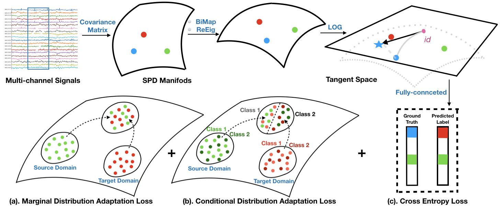

# Deep-Optimal-Transport-for-Domain-Adaptation-on-SPD-Manifolds

This is the official GitHub repository for "Deep Optimal Transport for Domain Adaptation on SPD Manifolds"

This work aims to establish a framework based on optimal transport on the SPD manifold for the domain transfer problem on the SPD manifold. As many different kinds of neural signals, such as EEG, ECoG, fMRI, etc., are multichannel time series, many relevant engineering methods consider these problems from the perspective of the signal covariance matrix. Therefore, this research will directly benefit from related engineering methods, especially from the **Geometric MI-BCI classifier** that we proposed.

[</img>](https://arxiv.org/abs/2201.05745)

